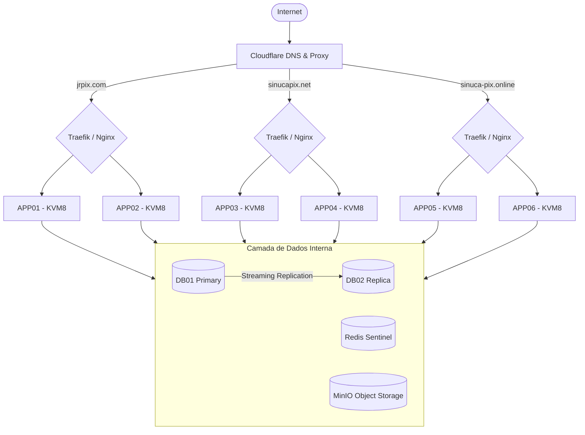

# Guia de Configuração e Arquitetura - Plataforma de Jogos (Sinuca Pix / JR Pix)

Este documento descreve a infraestrutura e os requisitos necessários para a configuração, instalação e deploy das aplicações nos servidores definitivos.

## 1. Visão Geral da Arquitetura

A infraestrutura foi projetada para alta disponibilidade (HA) e tolerância a falhas, utilizando **8 servidores VPS/KVM** (configuração máxima, com autobackup). A arquitetura distribui a carga da aplicação e do banco de dados para evitar inatividade.

- **Servidores de Aplicação:** 6 KVMs
- **Servidores de Banco de Dados:** 2 KVMs
- **Estratégia de Roteamento:** Load Balance e Failover (Round Robin com Heartbeat)
- **Distribuição Geográfica:** Para maximizar o SLA e a resiliência a regulações (rastro de legislação), cada nó de um par (ex: APP01 e APP02) deve estar idealmente em uma região ou país diferente.

---

## 2. Topologia de Servidores

### Camada de Aplicação (Docker Swarm)

| Servidor | Domínio / Aplicação | Função |
| :--- | :--- | :--- |
| **APP01** | `jrpix.com` | Nó Principal |
| **APP02** | `jrpix.com` | Nó Failover / Load Balance |
| **APP03** | `sinucapix.net` | Nó Principal |
| **APP04** | `sinucapix.net` | Nó Failover / Load Balance |
| **APP05** | `sinuca-pix.online` | Nó Principal |
| **APP06** | `sinuca-pix.online` | Nó Failover / Load Balance |

### Camada de Banco de Dados

| Servidor | Função | Notas |
| :--- | :--- | :--- |
| **DB01** | Banco Principal (Primary) | Escrita / Leitura |
| **DB02** | Banco Réplica (Replica) | Failover / PostgreSQL Streaming Replication |

---

## 3. Diagrama de Fluxo de Rede

---

## 4. Stack Tecnológico (Requisitos do Servidor)

Todos os servidores devem ser provisionados com as seguintes tecnologias de base:

**Sistema Operacional:**
- Ubuntu 24.04 LTS

**Orquestração e Redes:**
- Docker & Docker Swarm (Para os containers das aplicações)
- WireGuard Mesh (VPN interna para comunicação segura entre os 8 nós)

**Web Servers e Proxy:**
- Traefik (Ingress / Proxy Reverso Principal)
- Nginx
- Let's Encrypt (Certificados SSL automatizados)

**Segurança:**
- CrowdSec (Proteção colaborativa contra IPs maliciosos)
- Fail2Ban (Proteção contra força bruta)

**Persistência e Cache:**
- PostgreSQL 17 (Configurado com Streaming Replication)
- Redis (Configurado com Redis Sentinel para HA)
- MinIO (Storage de objetos compatível com S3 para arquivos de mídia/uploads)

---

## 5. Procedimento de Migração e Apontamento DNS

Para garantir tempo de inatividade zero (Zero Downtime) durante a transição:

1. **Montagem Prévia:** Todos os 8 servidores devem estar devidamente instalados, com a infraestrutura rodando (Docker, BDs, SSL providenciado via Traefik).
2. **Coleta de IPs:** Os IPs públicos dos 6 servidores de aplicação devem ser fornecidos com antecedência.
3. **Apontamento Cloudflare:** Assim que o cluster estiver saudável, altera-se os registros DNS na Cloudflare. Como a Cloudflare propaga os registros muito rapidamente (aprox. 5 minutos), o tráfego passará para os novos IPs sem o atraso de 96h de um parking normal.

---

## 6. Próximos Passos (Plano de Execução)

Para implementar esta infraestrutura, a sequência de configuração será:

1. **Provisionamento Inicial:** Instalação do Ubuntu 24.04 nos 8 nós. Configuração de SSH e segurança básica (Fail2Ban).
2. **Rede Privada (WireGuard):** Interligar os 8 nós numa rede mesh para comunicação de banco, cache e storage segura e rápida.
3. **Setup de Bancos e Cache:** Configurar o Master/Slave no PostgreSQL, e os nós do Redis e MinIO.
4. **Orquestração (Docker Swarm):** Iniciar o cluster swarm nos 6 nós de aplicação.
5. **Proxy Reverso (Traefik):** Configurar roteamento, middlewares e Let's Encrypt para gerenciar os domínios.
6. **Deploy das Aplicações:** Subir as imagens/stacks para cada site (`jrpix.com`, `sinucapix.net`, `sinuca-pix.online`).
7. **Testes de Failover:** Derrubar o banco primário e/ou nós de app para validar se as réplicas/load balancers assumem adequadamente.
8. **Virada de Chave (Cloudflare):** Apontar os DNS finais.